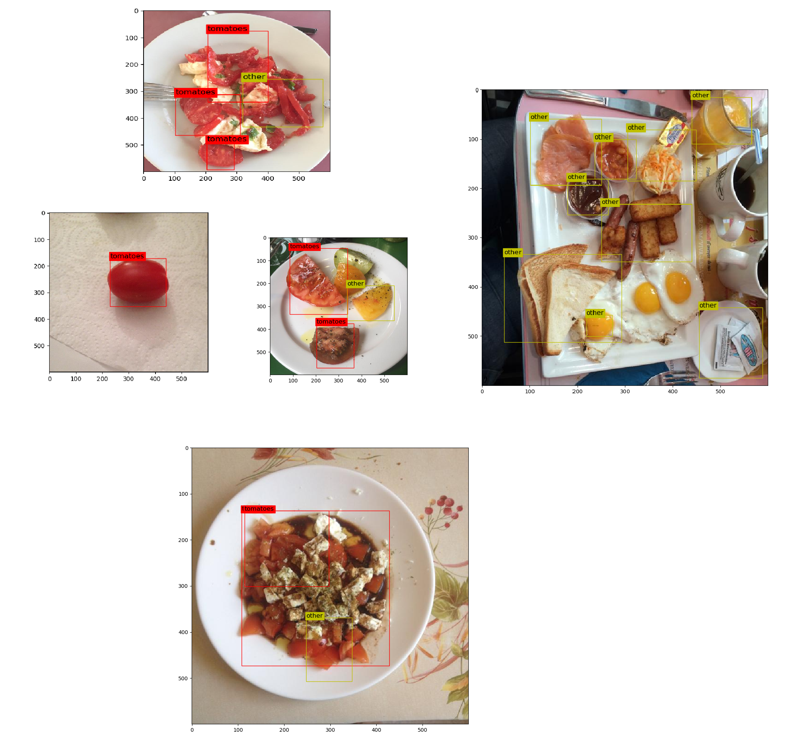

# Home assignment - Tomato allergies

Open domain image classification

## Context

In the context of meal logging, there is a fluctuating asymmetry between task evaluation (user expectation) and data qualification for training (result of labeling), that require specific care. Additionally, in order to have proper class separation, training sometimes requires a superior granularity compared to evaluation's. 

The research team of Foodvisor is in charge of creating the detection algorithm used for meal logging with the mobile app. Opening access to the app in a new region of the world usually brings about new user expectations.

## Assignment # 1

### Requirements

* Python 3

* Os

* Argparse

* Json

* csv

* glob

For the pre-process stage, no package installing is required.

For Darknet, you should the instructions explained [**here**](https://github.com/AlexeyAB/darknet) in details w.r.t the version you prefer to use.

For pytorch and keras, you should install requirements.txt with the following:

```python
pip install -r requirements_pytorch.txt
```

Or 

```python
pip install -r requirements_keras.txt
```

### Preprocess data

#### Explaination

A preprocess phase is required in order to identify classes that we want to detect. In this case, we want to detect the presence of tomatoes traces.

First, Tomatoes must be identified in *Label_mapping.csv*: we browse the ids labels and check in both of french and english labels if they contain "tomate" ( we deal with the case of : "Sans sauce tomate" ). We generate after this process, a list that link each id with its label (we denote by class 1: tomate and 0: by other object).

Second, we generate for each image a correspeding a .txt file containing the : label, Normlized bounding box information. We count as well the number of present bouding box of each class in order to do the split as a final step.

Finaly, we generate a train.txt and test.txt files with a train:test ratio of 83:17.  

#### Usage

**NOTE : this script must be in the same directory with label_mapping.csv, annotations_imgs.json and assignement_imgs/ to run by default. Otherwise, you can specify the pathd as arguments (check instruction below).**

The script : "pre_process_data.py" must be run in two parts, using the following :

```python
python pre_process_data.py --p 1
```

The output of this part is : a .txt files for each image. 

```python
python pre_process_data.py --p 0   
```

The output of this part is : train.txt and test.txt decribed above.

#### Arguments 

If the files are not present in the same directory, these arguments are required so the script can work.

* **--assignment_imgs (shortcut : --ip)**: path to data images.

* **--jsonPath (shortcut : --jp)** : path to annotations_imgs.json.

* **--csvFile (shortcut : --cp)** : path to label_mapping.csv.

* **--part (shortcut: --p)** : specify the script part (1 for part 1 and 0 for part 2).

### Model Training

#### Model choice and training

Since we are dealing with a detection problem, we decided to go with a pre-trained YOLO v4 (Complete and tiny version) with our custom dataset. We followed the configuration provided by the official github repo (See : [YOLO](https://github.com/AlexeyAB/darknet)). For computation limits, we choose to train the model in Google Colab following [This tutorial](https://medium.com/ai-world/how-to-train-yolov4-for-custom-objects-detection-in-google-colab-1e934b8ef685).

**Note** that several other models for object detection can be used for this task like: Resnet, Fast RCNN, MobileNet, Faster RCNN, Mask RCNN, ...

We could have tested these models, but for time limitations, we chose a Yolo model. 

#### Darknet

To train the yolo model using darknet, depending on your operating system, you must compile/build the darknet project. Then, for custom object detection, you must follow the configuration discribed [**here**](https://github.com/AlexeyAB/darknet#how-to-train-to-detect-your-custom-objects). Use `pre_process_data.py` to generate each_image.txt and train.txt files, then start training from a pretrained model with: `./darknet detector train data/obj.data yolo-obj.cfg yolov4.conv.137`. 

Training with Darknet is more efficient and less time consuming, but we don't have a direct access to the model details (output hidden layers, ...). It's an abstract version.   

#### Keras and Pytorch

The purpose of training yolo with keras/pytorch is that they are more flexible and easy to customize where we can visualize the output of the last layer activation in order to interpret the class activation extraction of the model for **Assignment 2**. However, the train step of this concrete implementation takes a lot of time.

The annotation file to train yolo with keras/pytorch is generated with the `pre_process_pytorch_keras.py` since we use a different way to labelling.

For train with pytorch, see [this github ripo](https://github.com/Tianxiaomo/pytorch-YOLOv4).

For train with keras, see [this github ripo](https://github.com/qqwweee/keras-yolo3).

(**Tensboard loss logs are in progress**)

### Model Testing

#### Darknet

`./darknet detect path/to/yolo.cfg path/to/yolo.weights path/to/image_test`

The output demo:



#### Keras and Pytorch

(**In Progress**)

# Assignment 2

We should return the last layer output before prediction. We have to overlay this output matrix (hitmap) on our original test image.

(**In Progress**)

